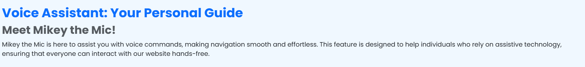
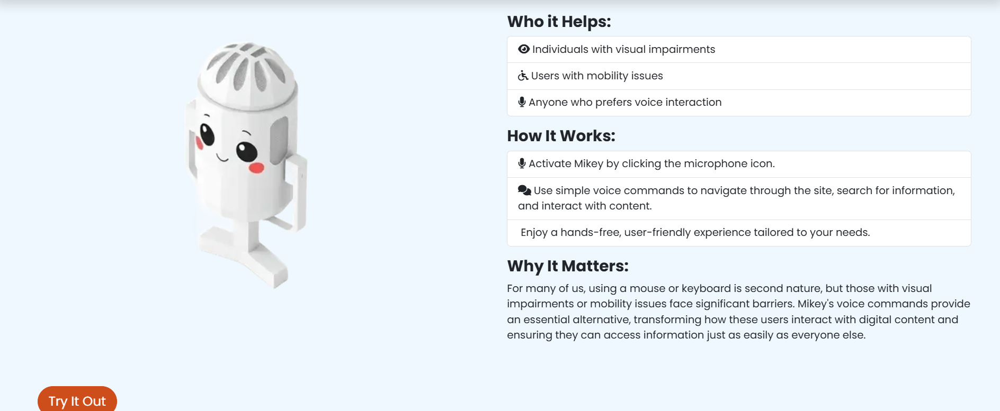
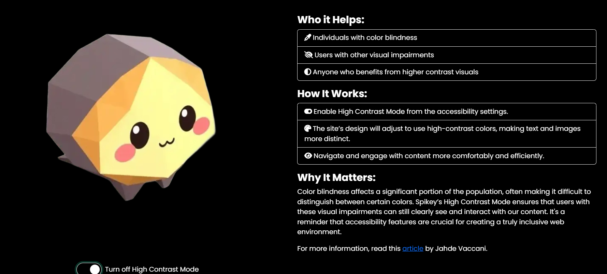

<h1 align="center"><strong>Inclusive Web: Building Accessible Websites. Hackathon</strong>

---

<h1 align="center"><strong>Access Granted</strong>

---


Access Granted - GitHub repository: [GitHub repository](https://github.com/VCGithubCode/access-granted/tree/as-accssesOk-branch)

Visit the deployed site: [Access Granted](https://vcgithubcode.github.io/access-granted/index.html)


# Project Overview

This project aims to create websites that are accessible and usable by everyone, regardless of their abilities or disabilities. Inclusive web design incorporates accessibility best practices, ensuring that websites are perceivable, operable, understandable, and robust for users with diverse needs, including those who use assistive technologies like screen readers, voice recognition software, or specialized input devices.

This project aims to empower developers to implement features and structures that adhere to accessibility standards (such as WCAG), making digital content inclusive for all users.

# Criteria of Success

The "Access Granted" project aims to make the web more accessible for all users, focusing on features like voice assistance, dyslexia-friendly fonts, and high-contrast modes for users with visual impairments. The site incorporates customizable accessibility settings, including font size adjustments, dyslexia-friendly fonts, colorblind modes, and high-contrast themes to enhance the user experience. It is dedicated to breaking down barriers and creating an inclusive, user-friendly digital environment.

- We have designed an immersive and intuitive user interface, ensuring that our design is not only visually distinctive but also delivers a smooth and engaging user experience.

- The success of our project is a result of careful planning and execution. We leveraged GitHub Projects for effective organization and complemented this with a detailed README.md to ensure transparency and keep our development on track.

- Our work is strongly aligned with the Hackathon's theme, presenting forward-thinking and creative solutions that push the boundaries of innovation. This project sets a new standard, paving the way for future developments.

- We’ve created a responsive, accessible, and well-tested application, emphasizing user experience across various devices and catering to diverse accessibility requirements.

- Our project introduces unique features and functionality, adding significant value and fostering engagement.

- A key strength of our project lies in the collaborative effort of our team. Through active involvement, inclusive practices, and a shared commitment to excellence, we’ve cultivated an environment of mutual support and high-quality outcomes. 


## Content

* [Access Granted](#access-granted)
* [Introduction](#introduction)
* [Criteria](#criteria)
* [Goal & UX](#goal--ux)
* [Website Structure](#website-structure)
  * [Landing Page](#landing-page)
  * [Explore Page](#explore-page)
  * [Contact Page](#contact)
  * [Responsiveness](#responsiveness)
* [TWireframes](#wareframes)
* [Development Process](#development-process)
  * [Agile Methodology](#agile-methodology)
  * [Collaboration Tools](#collaboration-tools)
  * [Programming paradigms](#programming-paradigms)
* [Prerequisites and Deployment](#prerequisites-and-deployment)
  * [Forking](#forking)
  * [Making a Local Clone](#making-a-local-clone)
  * [Obtaining EmailJS API](#obtaining-emailjs-api)
* [Credits and Acknowledgements](#credits-and-acknowledgements)


# Goal & UX

### As a visually impaired user, I benefit from the high contrast mode and larger text options, making the site easier to read.

- The "Accessibility Features" dropdown menu allows me to toggle these options without any hassle.
- I can also switch to the OpenDyslexic font, reducing visual stress while reading the content.
  
### As a user with color blindness, I appreciate the built-in colorblind modes like deuteranopia, protanopia, and tritanopia filters.

- I can see and differentiate the content, images, and icons by selecting the appropriate filter.
- As someone who relies on voice commands, I can easily enable the Voice Control feature.
- This allows me to navigate the site hands-free, making it convenient for individuals with mobility impairments.
  
### As a user exploring the site for resources, I find the navigation menu intuitive and straightforward.

- The links to the "Resources," "About," and "Contact" pages are visible and accessible.
- The "Skip to main content" link at the top ensures that I can bypass repetitive navigation and quickly access the core content.
  
### As a person who values inclusive design, I am delighted to see the comprehensive range of accessibility options.

- I can customize the theme (light, dark, high contrast) and font themes to suit my preferences, making my browsing experience more comfortable.
  
### As a user looking for help, the Contact page is easy to find.

- I can fill out a simple form, providing my name, email, and message, and expect a prompt response from the team.
- The site's address and contact information are also clearly listed, offering multiple ways to get in touch.
  
### As a user interested in learning about accessibility, I can navigate to the "Accessibility Guide".

- This page offers helpful tips and information on using the website's features effectively, demonstrating the project’s commitment to inclusivity.

*<span style="color: blue;">[Back to Content](#content)</span>*

# Website structure

## Landing Page


## Key Features

### Navigation & Header:

- The header includes a logo, navigation links, and an accessibility button that opens an off-canvas menu with settings.
- The navigation bar is responsive and features icons for clarity.
- Accessibility Settings Panel:

### The off-canvas menu offers customizable options:
- Font Size: Users can choose between small, medium, or large font sizes.
- Dyslexic Font: A toggle switch for enabling a dyslexia-friendly font.
- High Contrast Mode: A toggle to enhance visibility.
- Colorblind Modes: Options for Deuteranopia, Protanopia, and Tritanopia, using SVG filters for color adjustments.

## Main Content Section:

### A welcoming hero section with a title, description, and call-to-action button.
- The section features an illustration and a brief introduction to the purpose of the site, emphasizing its commitment to accessibility.
- Features Showcase:

### Three key features are highlighted:
- Voice Assistant: Enables hands-free navigation.
- OpenDyslexic Font: Enhances readability for users with dyslexia.
- High Contrast Mode: Improves visibility for users with visual impairments.

### Footer:
- Contains links to resources, social media profiles, and a site map.
- Includes a "Back to Top" button for easier navigation.
- Accessibility Enhancements:

The page includes an SVG filter section for color adjustments based on the selected colorblind mode.
Buttons and form elements have descriptive icons and ARIA labels for better screen reader support.


*<span style="color: blue;">[Back to Content](#content)</span>*

## Explore Page


## Key features

### Header Section:

- A welcoming banner with a headline introducing the purpose of the page.
- Includes a brief description emphasizing the importance of web accessibility.

### Carousel Section:
- A Bootstrap-based image carousel highlighting key concepts of accessibility, each with a caption and description.
- Three slides are included, each emphasizing different benefits of accessible design (e.g., user experience, inclusion).

### Accessibility Tools Articles:
-The page features three main articles, each dedicated to a specific accessibility feature:

### Voice Assistant ("Mikey the Mic")

- Describes voice navigation capabilities for users with visual impairments or mobility issues.
### OpenDyslexic Font ("Glassy with the Glasses")
- Explains the font switch for dyslexia-friendly text display, aiding users who struggle with standard fonts.

### High Contrast Mode ("Spikey the Hedgehog")
- Details a toggle for high-contrast visuals to assist users with color blindness or low vision.

### Each article outlines:
- Who it helps
- How it works
- Why it matters

### Tabs Section (Accessibility Standards):
- Utilizes Bootstrap tabs to provide information about various accessibility guidelines:
- WCAG (Web Content Accessibility Guidelines) [Link](https://www.w3.org/WAI/standards-guidelines/wcag/)
- ARIA (Accessible Rich Internet Applications) [Link](https://www.w3.org/WAI/standards-guidelines/aria/)
- Section 508 (U.S. federal requirements for accessible electronic content) [Link](https://www.section508.gov/)

### Simulation Section:
- Features interactive buttons allowing users to simulate various accessibility challenges (e.g., color blindness, low vision, screen reader use). This helps users understand the importance of inclusive design.

### Footer
- Provides useful links, a social media section, and a sitemap.
- A “Back to top” link enhances navigation, allowing users to quickly return to the top of the page.

*<span style="color: blue;">[Back to Content](#content)</span>*

# About Us

## Who We Are
- Welcome to Access Granted! We are a dynamic team of passionate developers and innovators with a shared vision: to make the web more accessible and inclusive for everyone. Our project is a testament to the power of collaboration, bringing together diverse skills and perspectives to create an online experience that truly caters to all users, regardless of their abilities.

## Our Mission
- Access Granted is driven by a mission to create a more inclusive digital world. We believe the internet should be a space where everyone feels welcomed and empowered. Our focus on accessibility, usability, and inclusivity aims to ensure that no user is left behind. We are committed to incorporating innovative solutions that address the needs of all individuals, including those with disabilities, through thoughtful design and user-friendly features.

## Meet Our Team
- Our talented team is the heart and soul of Access Granted. Each member brings a unique set of skills and expertise, contributing to the success of our project in their own special way.

## 🌟 Vernell Clark — SCRUM Leader
- Vernell ensures our team remains on track and focused. As our SCRUM Leader, he coordinate team efforts, facilitate meetings, and help resolve any obstacles. Vernell expertise in agile methodologies has been key to our project's timely and organized progress.

### Role: Project Management & Coordination
- GitHub: [VCGithubCode](https://github.com/VCGithubCode)
- LinkedIn: Vernell's LinkedIn

## 🎙️ Nikola Simic — Voice Assistant Developer
- Nikola has played a pivotal role in developing our voice assistant feature, making our website more accessible for users with visual impairments or those who prefer audio navigation. His innovative thinking and dedication to enhancing user experience have been invaluable.

### Role: Voice Interface Development
- GitHub: [nlekkerman](https://github.com/nlekkerman)
- LinkedIn: Nicola's's LinkedIn

## 📊 Benjamin Schäfer — Research & Page Layout Specialist
- Benjamin’s expertise in research and design has helped shape the overall look and feel of our site. His attention to detail and commitment to accessibility principles ensure our content is both aesthetically pleasing and user-friendly.

## Role: UX Design & Research
- GitHub: [benschaf](https://github.com/benschaf)
- LinkedIn: [Beni Schäfer's LinkedIn](https://www.linkedin.com/in/beni-schaefer/)

## ✍️ Angela Siniavskaja — Documentation Lead
- Angela has been instrumental in maintaining clear and concise project documentation. Her organizational skills have kept our team aligned, and her contributions have ensured that our project is thoroughly documented for future developers and users.

### Role: Documentation & Content Strategy
- GitHub: [Angela-Sin](https://github.com/Angela-Sin)
- LinkedIn: [Angela's LinkedIn](https://www.linkedin.com/in/angela-siniavskaja-a4500a22b/)

### 🎨 Ashraf Bocktor — Avatar Design Specialist
- Ashraf’s creative vision brought our project to life through beautifully crafted avatars. His designs not only reflect the diversity of our team but also resonate with our mission of inclusivity.

## Role: Avatar Design & Creative Direction
- GitHub: [PATH-HIVE](https://github.com/PATH-HIVE)
- LinkedIn: [Ashraf's LinkedIn](https://www.linkedin.com/in/abbocktor/)
  
  

### 🛠️ Alison Mossop — 404 Page Specialist
- Alison’s creativity shines in her work on our custom 404 error page, ensuring that even when users get lost, they encounter a friendly and helpful experience. Her innovative approach adds a unique touch to our project.

## Role: Error Page Design & User Engagement
- GitHub: [ali-moss-24](https://github.com/ali-moss-24)
- LinkedIn: [Alison's LinkedIn](https://www.linkedin.com/in/alison-mossop-4658a5253/)

## 🔍 James Bracken — Footer & Support Specialist
- James meticulously designed our footer, which provides a seamless navigation experience across the site. His focus on accessibility ensures that users can easily find the information they need, making our website more user-friendly.

### Role: Site Navigation & Support Features
- GitHub: [JamesBracken](https://github.com/JamesBracken)
- LinkedIn: Vernell's LinkedIn

## 🌐 Ahmad Al Hindi — About Page Specialist
- Ahmad took the lead in designing and creating this very page. His dedication to highlighting the team's contributions and presenting a cohesive narrative has made the About Us section a central part of our website’s storytelling.

### Role: Content Creation & Page Design
- GitHub: AhmadAlHindi
- LinkedIn: [Ahmad's LinkedIn](https://github.com/Ahmadalhindi)


Our Commitment to Accessibility
At Access Granted, we believe in the importance of inclusivity. We have implemented various accessibility features, such as:

Voice Assistant: For users who prefer auditory navigation.
High Contrast Mode: For improved readability.
Dyslexic Font Option: A font designed to be easier for dyslexic users to read.
Colorblind Modes: Filters for users with different types of color vision deficiencies.
These features reflect our ongoing commitment to creating an environment where everyone can interact with ease.

Join Us on Our Journey
We are excited about the future of Access Granted and the possibilities for making the web a more inclusive place. We invite you to explore our site, share your feedback, and join us in this mission.

Let’s make the internet accessible for all — together.

*<span style="color: blue;">[Back to Content](#content)</span>*

## Contact Page


The page provides a user-friendly Contact Us form along with accessibility features, making it easy for users to get in touch while ensuring a smooth experience for people with different accessibility needs. The layout is responsive, thanks to Bootstrap, and includes tools to adjust the design for better accessibility.

*<span style="color: blue;">[Back to Content](#content)</span>*


### Responsiveness

The website is fully responsive, providing a seamless experience on devices of all sizes, from smartphones to desktops. 
Please visit [Link](https://ui.dev/amiresponsive?url=https://vcgithubcode.github.io/access-granted/index.html)

*<span style="color: blue;">[Back to Content](#content)</span>*

## Design

- ### Wireframes

 - ###Landing Page
   


- ### Contact Page


*<span style="color: blue;">[Back to Content](#content)</span>*

## Development Process

The development of our project is guided by a structured yet adaptable approach, allowing us to respond to changes and feedback while staying focused on our objectives. Our methodology prioritizes collaboration, iterative progress, and transparency, both within the development team and with our stakeholders. [canvas](https://code-institute-room.slack.com/canvas/C080JB3ETHU)

*<span style="color: blue;">[Back to Content](#content)</span>*

### Agile Methodology

Our project follows the Agile methodology, a framework that enables us to tackle the inherent unpredictability of software development through incremental, iterative work cycles, known as sprints. This approach promotes adaptability and allows us to respond quickly to changes, which is crucial in the fast-paced world of software development.

At the beginning of each sprint, our team conducts sprint planning to set the course for the upcoming work. This includes prioritizing the product backlog to address the most important tasks first, establishing clear sprint goals aligned with project milestones, and assigning tasks based on expertise and workload. During development, we carefully manage trade-offs between scope, quality, time, and resources to ensure a balance between delivering high-quality work and meeting deadlines. By adopting Agile methodologies, we stay adaptable and focused, ensuring that we meet user needs while striving for excellence.


*<span style="color: blue;">[Back to Content](#content)</span>*

 ### Collaboration Tools
 
The team used [Slack](https://slack.com/) for quick collaboration purposes and Github projects to track User Stories, Bugs and Time plan.

The Team used slack team channel Canvas to ensure everyone stayed updated on project progress and discussions. [canvas](https://code-institute-room.slack.com/canvas/C080JB3ETHU)


*<span style="color: blue;">[Back to Content](#content)</span>*


## Features

- ### Color Pallete


- ## Technologies Used


- [](https://git-scm.com) used for version control. (`git add`, `git commit`, `git push`)
- [](https://github.com) used for secure online code storage.
- [](https://gitpod.io) used as a cloud-based IDE for development.
- [](https://code.visualstudio.com) used as a local IDE for development.
- [](https://en.wikipedia.org/wiki/HTML) used for the main site content.
- [](https://en.wikipedia.org/wiki/CSS) used for the main site design and layout.
- [](https://www.javascript.com) used for user interaction on the site.
- [](https://getbootstrap.com) used as the front-end CSS framework for modern responsiveness and pre-built components.
- [](https://fontawesome.com) used for the icons.
- [](https://chat.openai.com) used to help debug, troubleshoot, and explain things.

## Testing


### Further Testing


# Future adding

## Personalized Accessibility Settings:

### User Profiles:
- Allow users to create profiles where their accessibility settings (e.g., font size, colorblind mode, high contrast) can be saved and applied automatically when they visit the site.
Multi-device Syncing: Enable users to sync their accessibility preferences across different devices (mobile, tablet, desktop).
Voice Assistant Enhancements:

### Multi-language Support:
- Extend the voice assistant (Mikey the Mic) to support multiple languages, making it accessible to a wider audience.
Advanced Voice Commands: Implement more specific voice commands for easier navigation, such as "Go to Resources" or "Activate Colorblind Mode."

### Real-time Text-to-Speech:

- Implement a real-time text-to-speech feature that can read out any text on the website, providing an immersive experience for users with visual impairments.

### Enhanced Content Reader:

- Develop a more robust content reader for users with dyslexia or other reading difficulties, including options for text highlighting, word spacing, and reading speed adjustments.

### AI-Driven Accessibility Tools:

- Use AI to provide real-time suggestions to improve accessibility based on the user’s behavior and preferences (e.g., suggesting font changes or offering an easy-to-read mode based on the user’s interactions).

### Live Chat Support for Accessibility:

- Offer a live chat feature specifically focused on accessibility, where users can quickly reach support for technical issues or learn more about the available accessibility options.

### Mobile App Version:

- Create a mobile app that mirrors the website’s accessibility features, allowing users to customize their experience and access the site through their smartphones or tablets.

### Interactive Accessibility Tutorials:

- Build interactive guides that walk users through the various accessibility features of the site, helping them make the most of the tools available.

### Real-time User Feedback on Accessibility:

- Implement a system where users can provide real-time feedback about the accessibility features, helping to improve future versions of the site.

### Integration with Assistive Technology:

- Integrate the site with third-party assistive technologies such as screen readers, braille displays, or eye-tracking devices for users who rely on them.


## Prerequisites and Deployment

- The site was developed in VS Code/Gitpod, stored in GitHub as the local repository. Github Pages was used to deploy the live website. The instructions to ac- hieve this are below.

1. Log in to GitHub and locate the [GitHub Repository](https://github.com/)
2. At the top of the Repository (not the top of the page), locate the "Settings" Button on the menu.
   - Alternatively, Click [Here](https://raw.githubusercontent.com/) for a GIF demonstrating the process starting from Step 2.
3. Scroll down the Settings page until you locate the "GitHub Pages" Section.
4. Under "Source", click the dropdown called "None" and select "Master Branch".
5. The page will automatically refresh.
6. Scroll back down through the page to locate the now-published site [link](https://github.com) in the "GitHub Pages" section.

- ### Forking

- By forking the GitHub Repository we make a copy of the original repository on our GitHub account to view and/or make changes without affecting the original repository by using the following steps...

  1. Log in to GitHub and locate the [GitHub Repository](https://github.com/)
  2. At the top of the Repository (not the top of the page) just above the "Settings" Button on the menu, locate the "Fork" Button.
  3. You should now have a copy of the original repository in your GitHub account.

- ### Making a Local Clone

  1. Log in to GitHub and locate the [GitHub Repository](https://github.com/)
  2. Under the repository name, click "Clone or download".
  3. To clone the repository using HTTPS, under "Clone with HTTPS", copy the link.
  4. Open Git Bash
  5. Change the current working directory to where you want the cloned directory to be made.
  6. Type `git clone`, and then paste [https://github.com/YOUR-USERNAME/YOUR-REPOSITORY] in.
  7. Press Enter. Your local clone will be created.
  8. $ git clone [https://github.com/YOUR-USERNAME/YOUR-REPOSITORY]
  9. Cloning into `CI-Clone`...
  10. remote: Counting objects: 10, done.
  11. remote: Compressing objects: 100% (8/8), done.
  12. remove: Total 10 (delta 1), reused 10 (delta 1)
  13. Unpacking objects: 100% (10/10), done.

Click [Here](https://help.github.com/en/github/creating-cloning-and-archiving-repositories/cloning-a-repository#cloning-a-repository-to-github-desktop) to retrieve pictures for some of the buttons and more detailed explanations of the above process.

-  #### Obtaining EmailJS API 

  1. Sign up for a [EmailJS](https://www.emailjs.com/docs/) account in the EmailJS website.
  2. Create an email service in your EmailJS dashboard.
  3. Install EmailJS Library. You can do this by including the EmailJS script in your HTML file or by installing it via npm if you're using a package manager like npm or yarn.

```
npm install --save @emailjs/browser
```

or

```
$ yarn add @emailjs/browser
```
  4. In your EmailJS dashboard, navigate to the "API Keys" section and copy your API key.
  5. Add this code snippet before your closing tags. Making sure you have added your public key.

```js
<script type="text/javascript"
        src="https://cdn.jsdelivr.net/npm/@emailjs/browser@4/dist/email.min.js">
</script>
<script type="text/javascript">
  (function(){
      emailjs.init({
        publicKey: "YOUR_PUBLIC_KEY",
      });
  })();
</script>
```

  6.  Create an email template in your EmailJS dashboard. This template will define the content and structure of the emails you'll send.
  7. Write JavaScript function to send email using EmailJS. Below is a basic syntax for the code: 

```
emailjs.send(serviceID, templateID, templateParams, options);
```

  8. Call your function whenever you want to send an email.

*<span style="color: blue;">[Back to Content](#content)</span>*


### All content was written by the  Hackathon Team 7.


| Source                                                                                                               | Location       | Notes                        |
| -------------------------------------------------------------------------------------------------------------------- | -------------- | ---------------------------- |
| [YouTube](https://www.youtube.com/)                                                                                  | Acros website  | Tutorial for troubleshouting |
| [Font Awesome](https://fontawesome.com/)                                                                             | Across website | Inspiration for icons        |
| [Fonts Google](https://fonts.google.com/)                                                                            | Across website | Font selection               |
| [Coolors](https://coolors.co/)                                                                                       | Across website | Colour palette selection     |
| [W3Schools](https://www.w3schools.com/)                                                                              | Across website | Various help pages           |
| [Lucid.App](https://lucid.app/documents#/documents?folder_id=home)                                                   | Across website | Wireframes creation          |
| [Bootstrap](https://getbootstrap.com/docs/4.3/getting-started/introduction/)                                         | Across website | Css Layout, styling, Icons   |
| [Email.js](https://www.emailjs.com/)                                                                                 | Across website | For replying to users contact|
| [tiny.png](https://tinypng.com/)                                                                                     | Across website | For image convertion         |
| [Bootstrap](https://getbootstrap.com/docs/4.3/getting-started/introduction/)                                         | Across website | Responcivness                |
| [Bootstrap](https://getbootstrap.com/docs/4.3/getting-started/introduction/)                                         | Across website | Responcivness                |


### Acknowledgements

- Special Thank You Note for Hackathon Organizers
  
- Bootstrap Team for their responsive framework.
  
- OpenDyslexic project for the dyslexia-friendly font.
  
- Community testers who provided valuable feedback.

- Our team also deserves special mention as a whole. We learned a lot from each other, dove headfirst into new technologies, and were helpful in times of need to resolve coding issues.


  *<span style="color: blue;">[Back to Content](#content)</span>*


